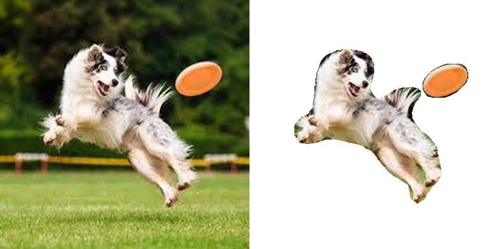
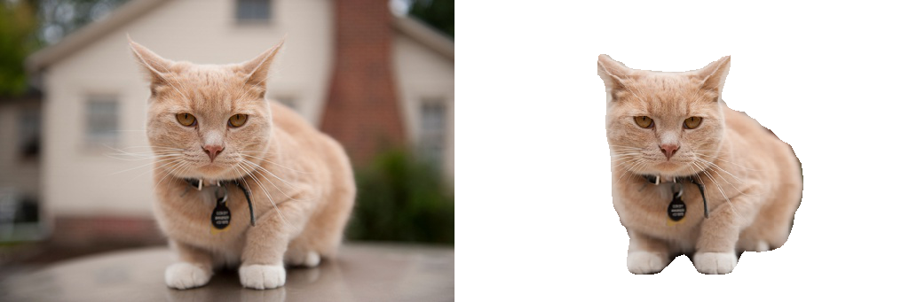
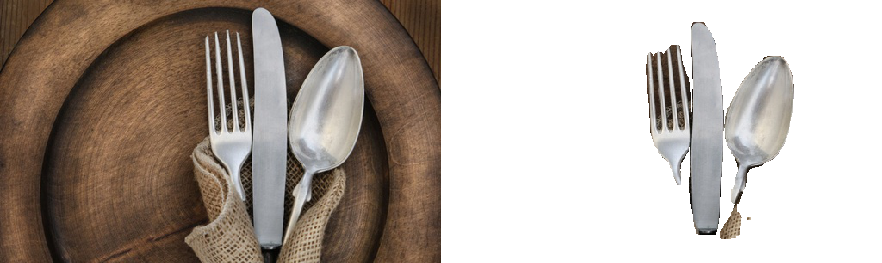
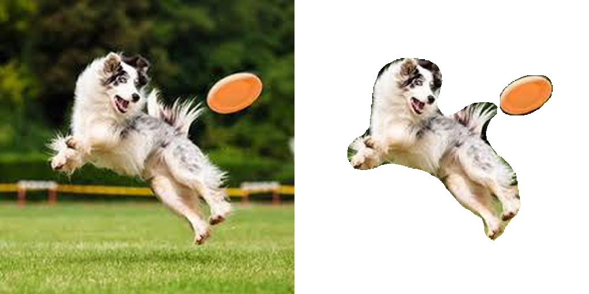
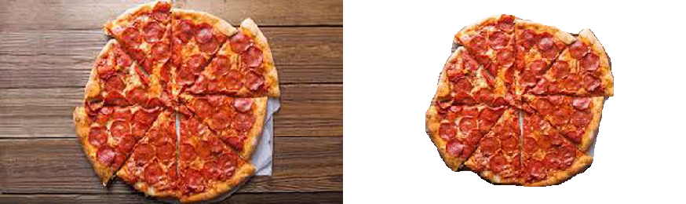

[](http://hits.dwyl.io/AlbertSuarez/object-cut)
[](https://github.com/AlbertSuarez/object-cut)
[](https://www.python.org/)
[](https://GitHub.com/AlbertSuarez/object-cut/stargazers/)
[](https://GitHub.com/AlbertSuarez/object-cut/network/)
[](https://github.com/AlbertSuarez/object-cut)

# ObjectCut

[Demo](https://objectcut.ga/) | [API](https://objectapi.ga/ui) | [Devpost](https://devpost.com/software/objectcut)

✂️ Cut an object of an image typing its name built in [PyTorch Summer Hackathon](https://pytorch.devpost.com/).

## Contents

1. [Results](#results)
2. [Summary](#summary)
   1. [Inspiration](#inspiration)
   2. [What it does](#what-it-does)
   3. [How we built it](#how-we-built-it)
   4. [Challenges we ran into](#challenges-we-ran-into)
   5. [Accomplishments that we're proud of](#accomplishments-that-were-proud-of)
   6. [What we learned](#what-we-learned)
   7. [What's next for ObjectCut](#whats-next-for-objectcut)
3. [API](#api)
   1. [Requirements](#requirements)
   2. [Recommendations](#recommendations)
   3. [Usage](#usage)
   4. [Endpoints](#endpoints)
   5. [Structure](#structure)
4. [Authors](#authors)
5. [License](#license)

## Results

Our project, as it will be explained below, gets an image from a URL or itself and a list of objects, and crops the object or objects for you in an automagic way. Here are some examples of what this application can do:







## Summary

### Inspiration

The inspiration came really from a moment where we needed to cut a person from a picture. We needed to make a simple extraction but we did not have the knowledge to do it or the tools (which most of them are not free like remove.bg, or what is more, not even available on Linux like Photoshop) so we decided to use Deep Learning to tackle this problem and allow to everybody do to extraction from a picture automatically.

### What it does

It takes a picture and a set of labels that are uploaded by the user, then we send that information to our API which then it runs a **Mask-RCNN** pytorch model to extract the masks of each class. Then using that information we are able to extract those pixels and return it without background. 

### How we built it

TODO

This tool works using a **Mask-RCNN** model trained with the **COCO dataset**, an extension of Faster-RCNN which adds the masks of each class that has been detected. 

<p align="center">
  

The model has two main stages. Firstly, using a **Region Proposal Network** (RPN) it generates several region proposals where there might be an object. Then, secondly, it predicts the class of the object, refines the bounding box and generates the mask in pixel level based on the first stage proposal. 

### Challenges we ran into

First of all, one member of the team had never worked with Pytorch, and the other one did very little (with the 0.4 version) so it was kind a challenge to get out our comfort zone. Then, our main goal was to make something actually useful so we needed to develop a complete project, not only an script or a tool available only for tech people; that created several challenges like adding the functionality of the script to a website, also the website had to be intuitive and well-designed and everything had to work smoothly.  

### Accomplishments that we're proud of

We are really proud with the final project we have developed. It is really useful and probably I will use it in the future.

### What we learned

We have learnt how beautiful can be to insert Deep Learning to your solutions using Pytorch and all its facilities: torchvision, datasets, etc. Until we came up with an idea of the project we really dived into it and we were amazed by all the possibilities it opened. 

### What's next for ObjectCut

ObjectCut can only extract 91 classes **COMPROVAR** since it is the COCO pretrained model but it would be a nice improvement to train it with more classes. Also another feature that could be interesting to implement would be to add the option to load your saved Mask-RCNN model in the website UI. 

## API

### Requirements

1. Python 3.7+.
2. docker.
3. docker-compose.

### Recommendations

Usage of [virtualenv](https://realpython.com/blog/python/python-virtual-environments-a-primer/) is recommended for package library / runtime isolation.

### Usage

To run the server, please execute the following from the root directory:

1. Change directory into the `api` folder.

  ```bash
  cd api/
  ```

2. Setup virtual environment.

3. Install dependencies.

  ```bash
  pip3 install -r requirements.lock
  ```

4. Run API server as a python module.

  ```bash
  python3 -m src
  ```

### Endpoints

#### Cut

Cuts or crops the specified objects from a given image and return encoded in Base64.

| Key                 | Type     | Description                                                  |
| ------------------- | -------- | ------------------------------------------------------------ |
| image_url           | string   | Internet accessible URL of an image.                         |
| Image_base64        | string   | URL and filename - safe base64(url) encoded image.           |
| objects             | string[] | List of objects to cut.                                      |
| return_white_bg     | boolean  | (optional) Return image with a white background instead of transparent. |

##### Request example

```bash
curl -d '{"image_url": URL, "objects": ["cat", "person"]}' -H "Content-Type: application/json" -X POST http://134.209.244.212:8083/cut
```

##### Response example

```json
{
    "error": false,
    "response": {
        "image_base64": "IMAGE_RESULT_ENCODED_IN_BASE64"
    }
}
```

### Structure

TODO

## Authors

- [Adrià Cabeza](https://github.com/adriacabeza)
- [Albert Suàrez](https://github.com/AlbertSuarez)

## License

MIT © ObjectCut
