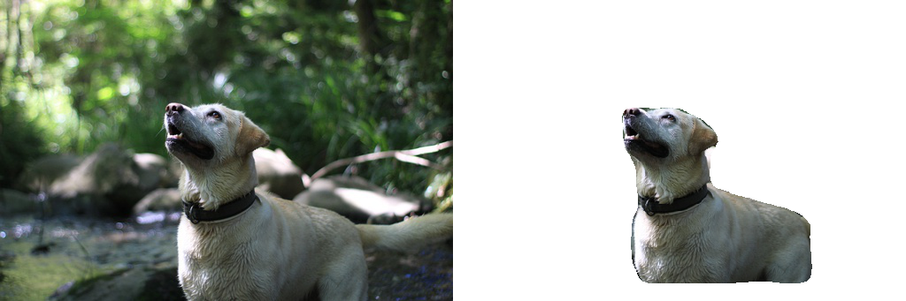
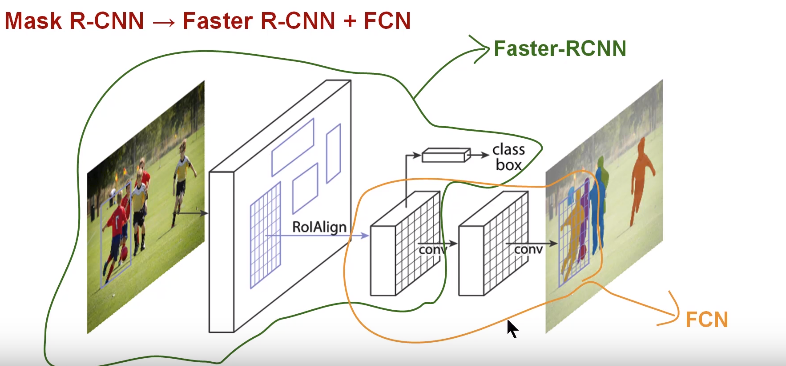
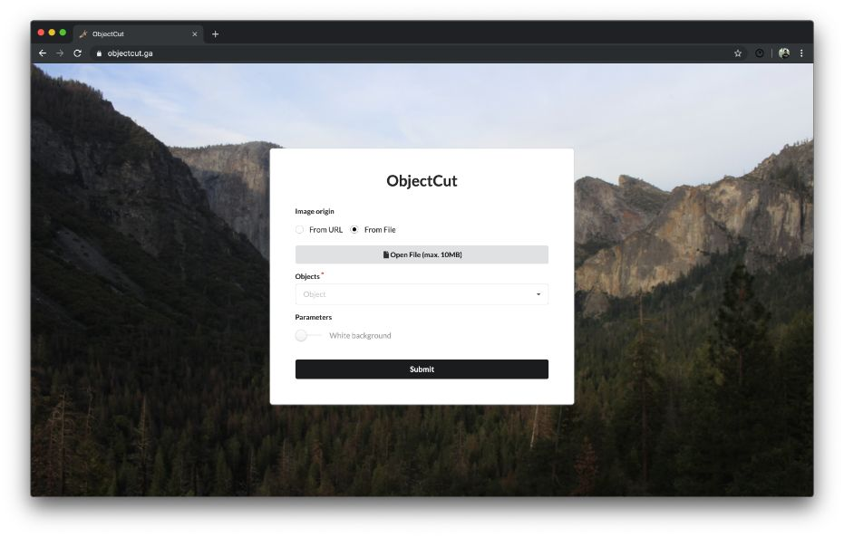
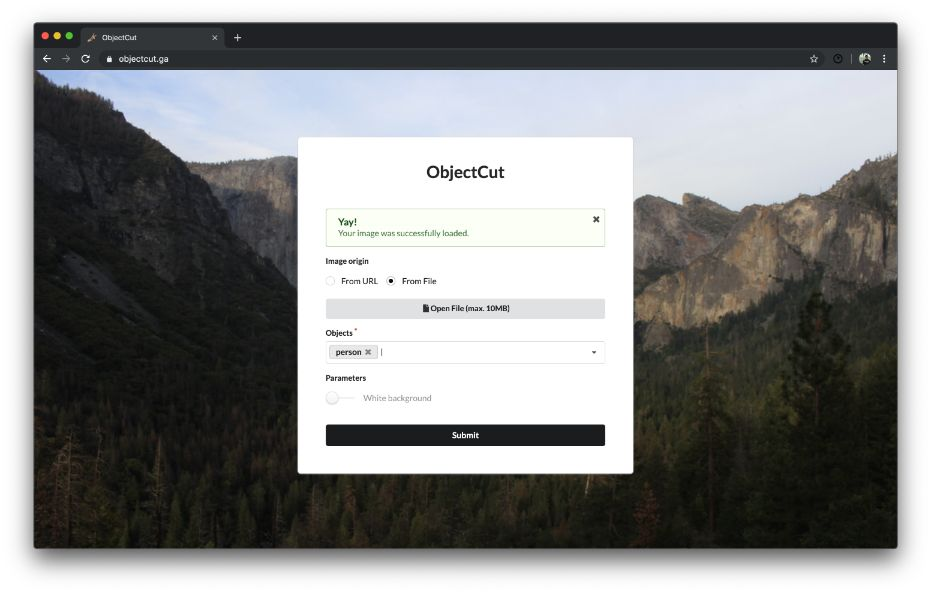
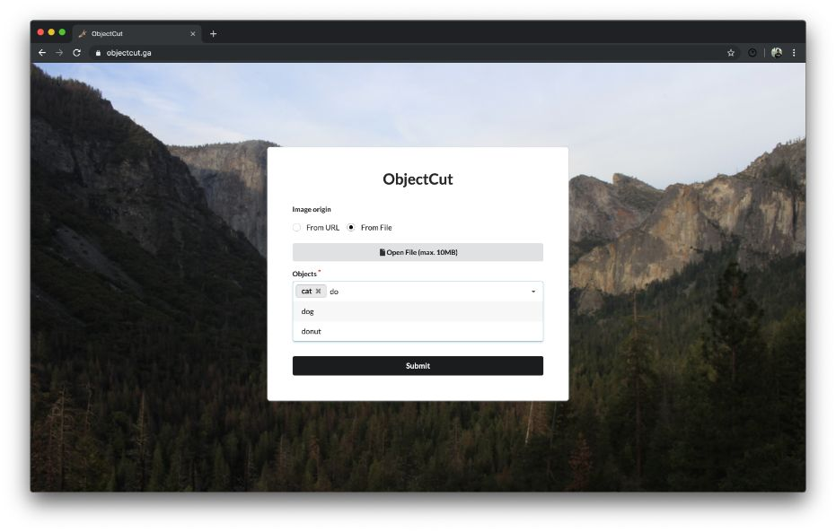
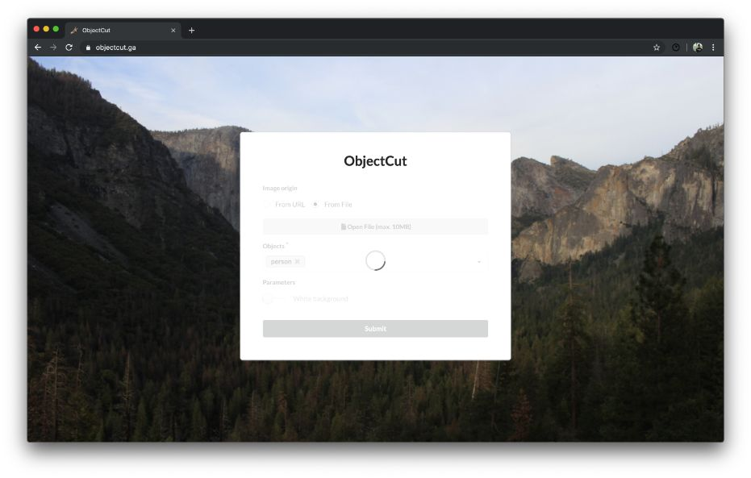
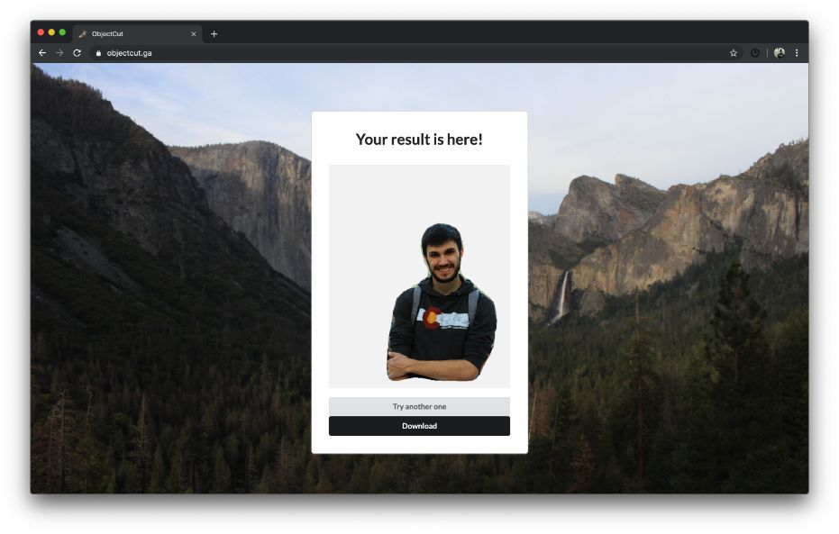

[](http://hits.dwyl.io/AlbertSuarez/object-cut)
[](https://github.com/AlbertSuarez/object-cut)
[](https://www.python.org/)
[](https://GitHub.com/AlbertSuarez/object-cut/stargazers/)
[](https://GitHub.com/AlbertSuarez/object-cut/network/)
[](https://github.com/AlbertSuarez/object-cut)

# ObjectCut

[Demo](https://objectcut.ga/) | [API Documentation](https://objectapi.ga/ui) | [Devpost](https://devpost.com/software/objectcut) | Video demo

✂️ Cut an object of an image typing its name in an automagic way built in [PyTorch Summer Hackathon](https://pytorch.devpost.com/).

## Contents

1. [Results](#results)
2. [Summary](#summary)
   1. [Inspiration](#inspiration)
   2. [What it does](#what-it-does)
   3. [How we built it](#how-we-built-it)
   4. [Challenges we ran into](#challenges-we-ran-into)
   5. [Accomplishments that we're proud of](#accomplishments-that-were-proud-of)
   6. [What we learned](#what-we-learned)
   7. [What's next for ObjectCut](#whats-next-for-objectcut)
3. [Screenshots](#screenshots)
4. [API](#api)
   1. [Requirements](#requirements)
   2. [Recommendations](#recommendations)
   3. [Usage](#usage)
   4. [Endpoints](#endpoints)
5. [Authors](#authors)
6. [License](#license)

## Results

Our project, as it will be explained below, gets an image from a URL or itself and a list of objects, and crops the object or objects for you in an automagic way. Here are some examples of what this application can do:




## Summary

### Inspiration

The inspiration came really from a moment where we needed to cut a person from a picture. We needed to make a simple extraction but we did not have the knowledge to do it or the tools (which most of them are not free like remove.bg, or what is more, not even available on Linux like Photoshop) so we decided to use Deep Learning to tackle this problem and allow to everybody do to extraction from a picture automatically.

### What it does

It takes a picture, from an Internet accessible URL or an image itself uploading it, and a set of labels that are typed by the user, then we send that information to our API which then it runs a **Mask-RCNN** PyTorch model to extract the masks of each class. Then using that information we are able to create a mask that includes all the desired classes to extract those pixels and return it without background. 

### How we built it

Frontend and backend are very different components connected by API requests.

At frontend, we can see a simple HTML (with CSS and JS) that uses the library [Semantic UI](https://semantic-ui.com/) in order to use the UI components. This part has been deployed using [GitHub pages](https://pages.github.com/) using custom and free .ga domain below HTTPS protocol.

In the other side of the application, we have the backend which is implemented with [Python 3.7](https://www.python.org/downloads/release/python-372/). For creating the API that allows the communication between the two components, we have used [Flask](http://flask.pocoo.org/) and [OpenAPI](https://swagger.io/docs/specification/about/) (connected themselves with [Connexion](https://connexion.readthedocs.io/en/latest/) library), integrated with [Docker compose](https://docs.docker.com/compose/). This API is hosted using [uWSGI](https://uwsgi-docs.readthedocs.io/en/latest/) and [Nginx](https://www.nginx.com/) in a small [DigitalOcean](https://www.digitalocean.com/) droplet with a secure reverse proxy through a [certbot](https://certbot.eff.org/) certificate (needed for a secure connection between both components).

To deal with image stuff like resizes or deleting the background we use [Pillow](https://pillow.readthedocs.io/en/stable/) Python's library, then as a main core of the application we use [torchvision](https://pytorch.org/docs/stable/torchvision/index.html) and its [Mask-RCNN](https://github.com/facebookresearch/maskrcnn-benchmark) model trained with the [COCO dataset](http://cocodataset.org/#home), an extension of Faster-RCNN which adds the masks of each class that has been detected. 

<p align="center">
  

The model has two main stages. Firstly, using a [Region Proposal Network](https://medium.com/egen/region-proposal-network-rpn-backbone-of-faster-r-cnn-4a744a38d7f9) (RPN) it generates several region proposals where there might be an object. Then, secondly, it predicts the class of the object, refines the bounding box and generates the mask in pixel level based on the first stage proposal. Using this outputted mask then we can create the image desired by the user. 

### Challenges we ran into

First of all, one member of the team had never worked with PyTorch, and the other one did very little (with the 0.4 version) so it was kind a challenge to get out our comfort zone. Then, our main goal was to make something actually useful so we needed to develop a complete project, not only an script or a tool available only for tech people; that created several challenges like adding the functionality of the script to a website, also the website had to be intuitive and well-designed and everything had to work smoothly.

Since we decided to use GitHub pages, with a HTTPS protocol, for deploying the frontend we needed to deploy the API with the same protocol, which encrypting and certifying a domain was a thing that no one of the team did.

### Accomplishments that we're proud of

We are really proud with the final project we have developed. It is really useful and probably we will use it in the future. Our goal was to build something that someone out of tech could use daily. Looking at the [result](https://objectcut.ga/), we think that we've achieved it.

### What we learned

We have learnt how beautiful can be to insert Deep Learning to your solutions using PyTorch and all its facilities: torchvision, datasets, etc. Until we came up with an idea of the project we really dived into it and we were amazed by all the possibilities it opened. Also we learnt, a lot, about how to deploy a real product (in the real world) using tools as it's been explained such as uWSGI, Nginx, etc. This last was important since we wanted to create something useful for us and for the community.

### What's next for ObjectCut

ObjectCut can only extract 91 classes since it is the COCO pretrained model but it would be a nice improvement to train it with more classes. Also another feature that could be interesting to implement would be to add the option to load your saved Mask-RCNN model in the website UI.

## Screenshots

This is how our project looks like unifying frontend and backend. If you want to see more, just check [our live demo](https://objectcut.ga/).







## API

### Requirements

1. Python 3.7+.
2. docker.
3. docker-compose.

### Recommendations

Usage of [virtualenv](https://realpython.com/blog/python/python-virtual-environments-a-primer/) is recommended for package library / runtime isolation.

### Usage

To run the server, please execute the following from the root directory:

1. Change directory into the `api` folder.

  ```bash
  cd api/
  ```

2. Setup virtual environment.

3. Install dependencies.

  ```bash
  pip3 install -r requirements.lock
  ```

4. Run API server as a python module.

  ```bash
  python3 -m src
  ```

### Endpoints

#### Cut

Cuts or crops the specified objects from a given image and return encoded in Base64.

| Key             | Type     | Description                                                  |
| --------------- | -------- | ------------------------------------------------------------ |
| image_url       | string   | Internet accessible URL of an image.                         |
| image_base64    | string   | URL and filename - safe base64(url) encoded image.           |
| objects         | string[] | List of objects to cut.                                      |
| return_white_bg | boolean  | (optional) Return image with a white background instead of transparent. |

##### Request example

```bash
curl -d '{"image_url": URL, "objects": ["cat", "person"]}' -H "Content-Type: application/json" -X POST http://134.209.244.212:8083/cut
```

##### Response example

```json
{
    "error": false,
    "response": {
        "image_base64": "IMAGE_RESULT_ENCODED_IN_BASE64"
    }
}
```

## Authors

- [Adrià Cabeza](https://github.com/adriacabeza)
- [Albert Suàrez](https://github.com/AlbertSuarez)

## License

MIT © ObjectCut
